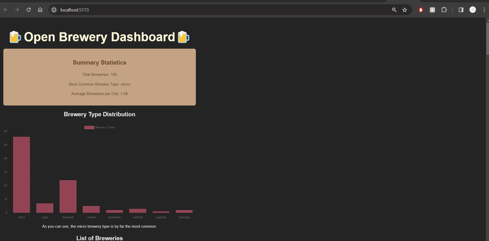

# Web Development Project 6 - Data Dashboard Part 2

Submitted by: Devon Purification

This web app: A data dashboard that provides an at-a-glance summary of information gathered from a public API. The dashboard view contains summary statistics and a list view of the data that can be searched and filtered. Using Open Brewery DB, the user is able to see a list of breweries, as well as their type, location, street, and website. Filter options include a search bar, city selection, and type selection.  

Time spent: **2** hours spent in total

## Required Features

The following **required** functionality is completed:

- [x] **The app includes at least one unique chart developed using the fetched data that tell an interesting story**
- [x] **Clicking on an item in the list view displays more details about it**
- [x] **Clicking on an item has a direct, unique link to that item's detail view page**

The following **optional** features are implemented:

- [x] The site's customized dashboard contains more content that explains what is interesting about the data
- [ ] The site allows users to toggle between different data visualizations

The following **additional** features are implemented:

* [ ] List anything else that you added to improve the site's functionality!

## Video Walkthrough

Here's a walkthrough of implemented user stories:

<!-- Replace this with whatever GIF tool you used! -->
GIF created with GIF created with [ScreenToGif](https://www.screentogif.com/) for Windows

## Notes

Had the same issue in the lab where all my information was hugging the left of the page, tried to look through the CSS to find the issue, but could not locate the problem. 

## License

    Copyright [yyyy] [name of copyright owner]

    Licensed under the Apache License, Version 2.0 (the "License");
    you may not use this file except in compliance with the License.
    You may obtain a copy of the License at

        http://www.apache.org/licenses/LICENSE-2.0

    Unless required by applicable law or agreed to in writing, software
    distributed under the License is distributed on an "AS IS" BASIS,
    WITHOUT WARRANTIES OR CONDITIONS OF ANY KIND, either express or implied.
    See the License for the specific language governing permissions and
    limitations under the License.
